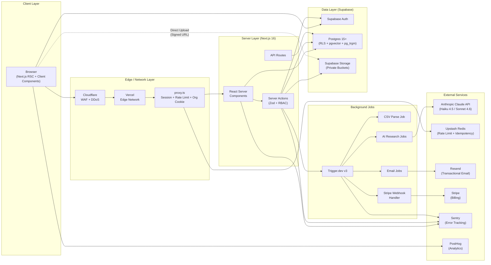
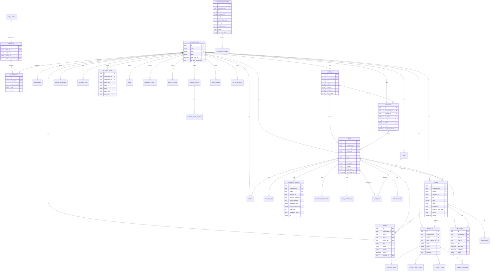
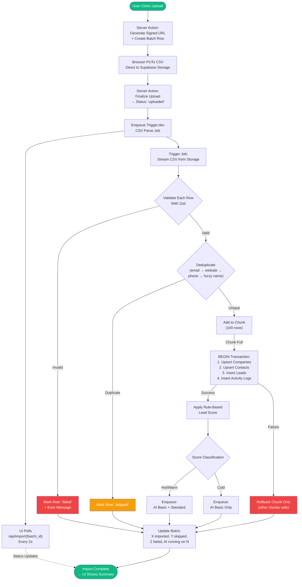
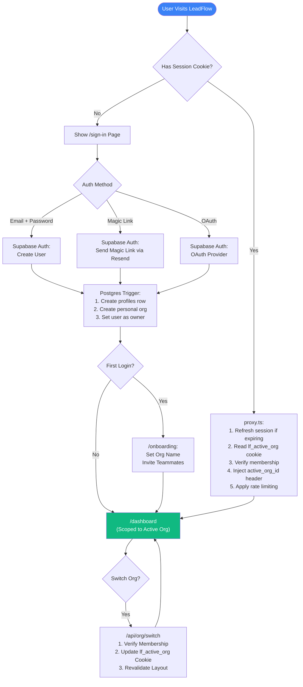
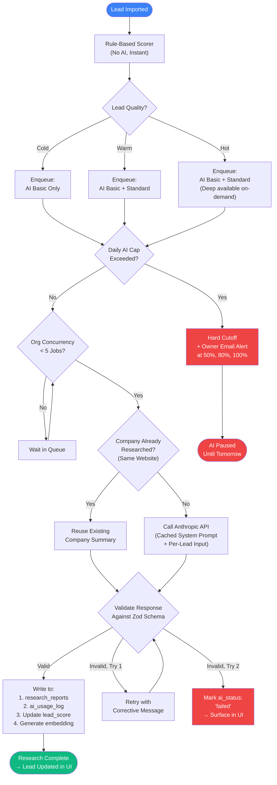
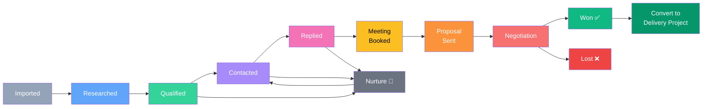
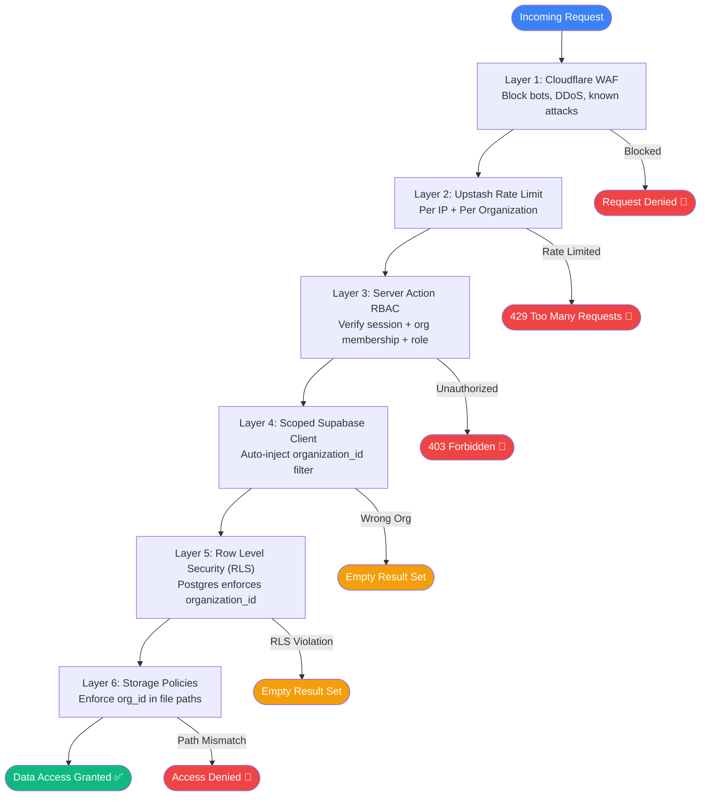

# LeadFlow CRM — Production Plan v2

## Production Architecture & Execution Plan v2

> **Stack:** Next.js 16 · Supabase (Auth + Postgres + Storage) · Trigger.dev · Anthropic
>
> **Timeline:** ~6 weeks solo, ~3 weeks with a team.

---

## Table of Contents

- [0. Executive Summary](#0-executive-summary)
- [1. Final Production Stack](#1-final-production-stack)
- [2. Architecture Principles](#2-architecture-principles)
- [3. Data Model](#3-data-model)
- [4. Row Level Security Strategy](#4-row-level-security-strategy)
- [5. Storage Architecture](#5-storage-architecture)
- [6. Authentication & Authorization](#6-authentication--authorization)
- [7. CSV Import Pipeline](#7-csv-import-pipeline-the-wedge-feature)
- [8. AI Research & Scoring](#8-ai-research--scoring)
- [9. Six-Phase Production Roadmap](#9-six-phase-production-roadmap)
- [10. Security Checklist](#10-security-checklist)
- [11. Performance Targets](#11-performance-targets)
- [12. Observability](#12-observability)
- [13. Environments](#13-environments)
- [14. Testing Strategy](#14-testing-strategy)
- [15. What's NOT in v1](#15-whats-not-in-v1-deliberately)
- [16. Pre-Launch Checklist](#16-pre-launch-checklist)
- [17. Final Developer Prompt](#17-final-developer-prompt)
- [Appendix A: System Architecture Flowchart](#appendix-a-system-architecture-flowchart)
- [Appendix B: Entity Relationship Diagram](#appendix-b-entity-relationship-diagram)
- [Appendix C: CSV Import Pipeline Flowchart](#appendix-c-csv-import-pipeline-flowchart)
- [Appendix D: Authentication Flow](#appendix-d-authentication-flow)
- [Appendix E: AI Research Pipeline Flow](#appendix-e-ai-research-pipeline-flow)
- [Appendix F: Sales Pipeline Stage Flow](#appendix-f-sales-pipeline-stage-flow)
- [Appendix G: Defense-in-Depth Security Layers](#appendix-g-defense-in-depth-security-layers)
- [Appendix H: Six-Phase Roadmap Flow](#appendix-h-six-phase-roadmap-flow)

---

## 0. Executive Summary

LeadFlow is a **multi-tenant AI sales CRM**. The user uploads a CSV of leads exported from an external lead-generation tool. LeadFlow cleans the data, deduplicates against existing leads, enriches each lead via AI research, scores it, moves it through a sales pipeline, tracks meetings and outreach, and turns won deals into delivery projects.

This v2 plan replaces the original Clerk + Supabase plan with a **unified Supabase Auth stack** on Next.js 16. The motivating changes are:

1. Tighter RLS integration with `auth.uid()`
2. One fewer vendor and webhook to manage
3. Faster onboarding for a solo builder
4. Native support for the Next.js 16 `proxy.ts` request boundary and Cache Components

### Production Readiness Definition

Real users can sign up, import 10,000-row CSVs without timeouts, get AI research delivered within 5 minutes, navigate a fast leads table, and **never see another tenant's data** — with backups, error tracking, rate limiting, and an admin-visible audit log running from day one.

### Why the Stack Changed from v1

| Change | Reason |
|--------|--------|
| **Clerk dropped** | Supabase Auth is enough for the scope; avoids JWT-template gymnastics for Clerk org IDs in Postgres RLS |
| **Trigger.dev added** | Next.js server actions cannot run a 10-minute CSV parse; a real durable job queue is non-negotiable |
| **Upstash Redis added** | Rate limiting and idempotency keys at the edge |
| **Sentry + PostHog added** | Cannot debug or improve what you cannot see |
| **pgvector enabled** | Embeddings on day one means lead similarity and AI memory work later without a migration |
| **Next.js 16 specifics** | `proxy.ts` replaces `middleware.ts`, Cache Components opt-in for the dashboard, Turbopack default |

---

## 1. Final Production Stack

> ⚠️ **Every choice below is locked. Do not swap components mid-build.**

| Layer | Choice | Why |
|-------|--------|-----|
| **Framework** | Next.js 16 (App Router) | RSC, server actions, Cache Components, proxy.ts, stable Turbopack |
| **Runtime** | Node.js 22 LTS | Required by Next.js 16, native fetch, native TS for config |
| **Language** | TypeScript 5.6+ | Type safety end-to-end, strict mode on |
| **Auth** | Supabase Auth | Email + OAuth + magic link; `auth.uid()` integrates natively with RLS |
| **Database** | Supabase Postgres 15+ | Multi-tenant via RLS, pgvector built in, PITR backups |
| **Storage** | Supabase Storage | Private buckets, signed URLs, RLS policies |
| **Edge cache + rate limit** | Upstash Redis | Serverless, pay-per-request, free tier covers MVP |
| **Background jobs** | Trigger.dev v3 | Durable retries, schedules, observable runs, generous free tier |
| **AI** | Anthropic Claude API | Claude Haiku 4.5 (Basic), Sonnet 4.6 (Standard), Sonnet 4.6 + tools (Deep) |
| **UI** | Tailwind CSS v4 + shadcn/ui | Design system primitives, fast iteration |
| **Data table** | TanStack Table v8 | Server-side pagination, filtering, sorting, virtualization |
| **Forms** | React Hook Form + Zod | Type-safe forms, shared validation schemas client + server |
| **State / data fetching** | TanStack Query v5 | Cache invalidation, optimistic updates, suspense integration |
| **Kanban** | dnd-kit | Accessible drag-and-drop |
| **Charts** | Recharts | Composable, fits shadcn aesthetic |
| **Error tracking** | Sentry | Frontend + backend + Trigger jobs in one view |
| **Product analytics** | PostHog | Funnel, feature flags, session replay |
| **Email** | Resend | Transactional email, simple API, React Email templates |
| **Hosting** | Vercel | Best Next.js DX, edge network, preview deploys |
| **DNS + WAF** | Cloudflare | Bot protection, DDoS mitigation on the apex domain |
| **Automation (later)** | n8n self-hosted | Visual flows for email follow-ups, calendar sync |

---

## 2. Architecture Principles

> These principles override convenience. Every PR must respect them or be rejected.

### 2.1 Multi-tenancy is Non-optional

- Every tenant-owned table has `organization_id NOT NULL` with a foreign key to `organizations`.
- Every query in application code goes through a **scoped client** that injects `organization_id` automatically.
- RLS is enabled on every tenant table as **defense-in-depth**, even though app code already filters.
- Storage paths always start with `{organization_id}/` and storage policies enforce it.

### 2.2 Server-first, RSC by Default

- Data fetching happens in Server Components and server actions. Client components only handle interactivity.
- Mutations go through server actions with Zod validation, never raw fetch from the browser.
- Service role key only used in server code, **never** bundled to client.

### 2.3 Async Everything That Can Fail or Take Time

- CSV parsing, AI research, email sending, embeddings generation all run in **Trigger.dev jobs**.
- Every job has an `idempotency_key` so retries are safe.
- Server actions return job IDs and the UI polls for completion.

### 2.4 Defense in Depth

| Layer | Defense |
|-------|---------|
| **Layer 1** | Cloudflare WAF blocks obvious abuse |
| **Layer 2** | Upstash rate limit per IP and per organization |
| **Layer 3** | Server action checks org membership and role |
| **Layer 4** | Scoped Supabase client filters by `organization_id` |
| **Layer 5** | RLS enforces `organization_id` at the database |
| **Layer 6** | Storage policies enforce `organization_id` in paths |

### 2.5 Observability from Day One

- **Sentry** captures unhandled errors in frontend, backend, and jobs.
- **Structured logs** use a single logger with `org_id`, `user_id`, `request_id` in every entry.
- **AI calls** are logged with token counts and cost in `ai_usage_log` before returning to the user.
- **PostHog** captures key product events: `signup`, `first_import`, `first_ai_research`, `first_pipeline_move`, `first_deal_won`.

---

## 3. Data Model

Below is the complete schema needed for v1. Every table follows the **standard column set**:

| Column | Type | Details |
|--------|------|---------|
| `id` | `uuid` | Primary key |
| `organization_id` | `uuid NOT NULL` | Foreign key to organizations |
| `created_by` | `uuid` | Foreign key to profiles |
| `created_at` | `timestamptz` | `DEFAULT now()` |
| `updated_at` | `timestamptz` | `DEFAULT now()` |
| `deleted_at` | `timestamptz` | Soft delete marker |
| `version` | `int` | `DEFAULT 1` — optimistic concurrency control |

### 3.1 Auth and Tenant Tables

| Table | Purpose | Key Columns |
|-------|---------|-------------|
| **profiles** | One row per `auth.users` row, populated by trigger on auth user creation | `full_name`, `avatar_url`, `default_organization_id` |
| **organizations** | Tenant root | `name`, `slug` (unique), `plan` (free/pro/business), `trial_ends_at`, `ai_daily_cap_cents` |
| **memberships** | Links profiles to organizations | `role` (owner/admin/sales/project_manager/viewer/client), `status` (active/invited/suspended) |
| **invitations** | Pending invites | `email`, `token`, `role`, `expires_at` |

### 3.2 Core CRM Tables

| Table | Purpose | Key Columns |
|-------|---------|-------------|
| **companies** | Business entity | `name`, `website` (unique within org), `industry`, `size_band`, `location`, `ai_summary` |
| **contacts** | Person at a company | `full_name`, `email` (unique within org when present), `phone`, `job_title`, `linkedin_url`, `is_decision_maker` |
| **leads** | Core record linking company + contact | `source`, `status`, `lead_score` (0–100), `lead_quality` (hot/warm/cold), `ai_status` (pending/running/completed/failed), `assigned_to`, `last_contacted_at`, `next_follow_up_at` |
| **deals** | Opportunity in pipeline | `title`, `value`, `stage`, `probability`, `expected_close_date`, `owner_id`, `status` (open/won/lost), `lost_reason`, `won_at` |
| **tasks** | Todos (polymorphic) | `title`, `description`, `status`, `priority`, `due_at`, `assigned_to`; optional `lead_id`, `deal_id`, `project_id` |
| **notes** | Free-form text on any entity | `entity_type`, `entity_id`, `content` |
| **tags + lead_tags** | Many-to-many tagging | Tag `name` + join table |
| **attachments** | File metadata | `storage_path`, `file_size`, `mime_type`, `entity_type`, `entity_id` |

### 3.3 CSV Import Tables

| Table | Purpose | Key Columns |
|-------|---------|-------------|
| **csv_import_batches** | One row per upload | `file_name`, `storage_path`, `total_rows`, `successful_rows`, `failed_rows`, `duplicate_rows`, `status` (uploaded/parsing/processing/completed/failed), `uploaded_by`, `idempotency_key` (unique), `started_at`, `completed_at`, `error_summary_json` |
| **csv_import_rows** | One row per CSV row | `batch_id`, `row_number`, `raw_data_json`, `mapped_data_json`, `status` (pending/imported/skipped/failed), `error_message`, `created_lead_id` |
| **import_mappings** | Saved column mappings per org for reuse | `organization_id`, `mapping_config_json` |

### 3.4 AI and Research Tables

| Table | Purpose | Key Columns |
|-------|---------|-------------|
| **research_reports** | AI output per lead | `company_summary`, `website_analysis`, `pain_points_json`, `recommended_offer`, `outreach_angle`, `objections_json`, `next_best_action`, `lead_score`, `confidence_score` (0–1), `model`, `tier` (basic/standard/deep), `status` |
| **outreach_messages** | Generated outreach drafts | `channel` (email/linkedin/sms), `subject`, `body`, `status` (draft/sent/replied) |
| **ai_usage_log** | Cost tracking | `lead_id` (nullable), `model`, `tier`, `prompt_tokens`, `completion_tokens`, `cached_tokens`, `cost_usd_cents`, `latency_ms`, `status` |
| **lead_embeddings** | pgvector | `lead_id` (pk), `embedding` vector(1536), `source_text`, `created_at` |

### 3.5 Sales Tables

| Table | Purpose | Key Columns |
|-------|---------|-------------|
| **meetings** | Calendar events | `lead_id`, `deal_id`, `title`, `start_time`, `end_time`, `meeting_url`, `calendar_event_id`, `status`, `notes`, `ai_summary`, `next_steps_json` |
| **proposals** | Quotes sent to leads | `deal_id`, `version`, `total_value`, `valid_until`, `status`, `storage_path` |
| **follow_ups** | Scheduled reminders | `lead_id`, `scheduled_for`, `reason`, `status` |

### 3.6 Project Delivery Tables

| Table | Purpose | Key Columns |
|-------|---------|-------------|
| **projects** | Won deal → delivery project | `client_company_id`, `deal_id`, `name`, `type`, `status`, `budget`, `deadline`, `tech_stack_json`, `github_repo`, `staging_url`, `live_url` |
| **project_tasks** | Tasks within a project | Standard task columns scoped to `project_id` |
| **project_milestones** | Major deliverables | `project_id`, `name`, `due_date`, `status` |
| **project_files** | Project deliverables | `project_id`, `storage_path`, `file_size`, `mime_type` |
| **project_updates** | Client-visible updates | `project_id`, `title`, `body`, `is_client_visible` |

### 3.7 Infrastructure Tables

| Table | Purpose | Key Columns |
|-------|---------|-------------|
| **jobs** | Trigger.dev runs mirror | `type`, `payload_json`, `status`, `attempts`, `max_attempts`, `last_error`, `idempotency_key` (unique), `scheduled_for`, `started_at`, `completed_at` |
| **activity_logs** | Audit trail | `actor_profile_id`, `entity_type`, `entity_id`, `action` (created/updated/deleted/restored/imported/scored/researched), `before_json`, `after_json` |
| **webhook_events** | Inbound webhook log | `source`, `event_type`, `payload_json`, `signature`, `verified` (bool), `processed_at`, `idempotency_key` (unique) |
| **api_rate_limits** | Fallback rate limiter | `organization_id`, `bucket`, `count`, `window_start` |
| **notifications** | In-app notifications | `profile_id`, `type`, `title`, `body`, `link`, `read_at` |

### 3.8 Customization Tables

| Table | Purpose | Key Columns |
|-------|---------|-------------|
| **custom_fields** | Per-org field definitions | `entity_type`, `name`, `type` (text/number/date/boolean/select), `options_json`, `required`, `position` |
| **custom_field_values** | Values for custom fields | `custom_field_id`, `entity_id`, `value_json` |
| **saved_views** | Saved table filters and column configs | `entity_type`, `name`, `config_json`, `is_shared` |

---

## 4. Row Level Security Strategy

> RLS is the **last line of defense**, not the first. Application code should always filter by `organization_id` explicitly. RLS catches the bug where someone forgot.

### 4.1 The Helper Function

Create one SQL function that returns the active `organization_id` for the current request.

```sql
-- Returns active organization_id for the current authenticated user
CREATE OR REPLACE FUNCTION app.active_organization_id()
RETURNS uuid
LANGUAGE sql
STABLE
SECURITY DEFINER
SET search_path = public, pg_temp
AS $$
  SELECT (current_setting('request.jwt.claims', true)::jsonb ->> 'active_org_id')::uuid
$$;

-- Returns whether current user is a member of the given organization
CREATE OR REPLACE FUNCTION app.is_member(org_id uuid)
RETURNS boolean
LANGUAGE sql
STABLE
SECURITY DEFINER
SET search_path = public, pg_temp
AS $$
  SELECT EXISTS (
    SELECT 1 FROM public.memberships m
    JOIN public.profiles p ON p.id = m.profile_id
    WHERE m.organization_id = org_id
      AND p.user_id = auth.uid()
      AND m.status = 'active'
  )
$$;
```

### 4.2 Standard RLS Policy Template

Every tenant table gets these four policies (replace `leads` with the table name):

```sql
ALTER TABLE public.leads ENABLE ROW LEVEL SECURITY;

CREATE POLICY "leads_select" ON public.leads FOR SELECT
  USING ( app.is_member(organization_id) );

CREATE POLICY "leads_insert" ON public.leads FOR INSERT
  WITH CHECK ( app.is_member(organization_id)
    AND organization_id = app.active_organization_id() );

CREATE POLICY "leads_update" ON public.leads FOR UPDATE
  USING ( app.is_member(organization_id) )
  WITH CHECK ( app.is_member(organization_id) );

CREATE POLICY "leads_delete" ON public.leads FOR DELETE
  USING ( app.is_member(organization_id) );
```

### 4.3 Critical Indexes

RLS without indexes is slow. Every policy filter must hit an index.

```sql
CREATE INDEX idx_memberships_profile_org
  ON memberships(profile_id, organization_id) WHERE status = 'active';

CREATE INDEX idx_leads_org
  ON leads(organization_id) WHERE deleted_at IS NULL;

CREATE INDEX idx_leads_org_status
  ON leads(organization_id, status) WHERE deleted_at IS NULL;

CREATE INDEX idx_leads_org_quality
  ON leads(organization_id, lead_quality) WHERE deleted_at IS NULL;

CREATE INDEX idx_leads_org_assigned
  ON leads(organization_id, assigned_to) WHERE deleted_at IS NULL;

CREATE INDEX idx_leads_org_followup
  ON leads(organization_id, next_follow_up_at)
  WHERE deleted_at IS NULL AND next_follow_up_at IS NOT NULL;

CREATE INDEX idx_leads_org_created
  ON leads(organization_id, created_at DESC) WHERE deleted_at IS NULL;

CREATE INDEX idx_companies_org_website
  ON companies(organization_id, lower(website)) WHERE deleted_at IS NULL;

CREATE INDEX idx_contacts_org_email
  ON contacts(organization_id, lower(email))
  WHERE deleted_at IS NULL AND email IS NOT NULL;

CREATE INDEX idx_csv_rows_batch_status
  ON csv_import_rows(batch_id, status);

CREATE INDEX idx_jobs_status_scheduled
  ON jobs(status, scheduled_for) WHERE status IN ('queued', 'running');

CREATE INDEX idx_lead_embeddings_org
  ON lead_embeddings USING hnsw (embedding vector_cosine_ops);
```

---

## 5. Storage Architecture

> All buckets are **private**. Files are accessed via signed URLs generated server-side.

| Bucket | Purpose | Path Pattern |
|--------|---------|--------------|
| `csv-imports` | Uploaded CSV files | `{org_id}/imports/{batch_id}/original.csv` |
| `lead-attachments` | Files attached to leads | `{org_id}/leads/{lead_id}/{uuid}-{filename}` |
| `proposal-files` | Quotes and proposals | `{org_id}/deals/{deal_id}/{uuid}-{filename}` |
| `project-files` | Project deliverables | `{org_id}/projects/{project_id}/{uuid}-{filename}` |
| `meeting-transcripts` | Recordings, notes | `{org_id}/meetings/{meeting_id}/{uuid}-{filename}` |
| `company-assets` | Logos, screenshots | `{org_id}/companies/{company_id}/{uuid}-{filename}` |
| `avatars` | User avatars (public CDN OK) | `{user_id}/{uuid}.{ext}` |

### 5.1 Storage RLS Policy Template

```sql
-- Allow members of the org to read files in their org's folder
CREATE POLICY "csv_imports_member_read" ON storage.objects FOR SELECT
  USING (
    bucket_id = 'csv-imports'
    AND (storage.foldername(name))[1]::uuid IN (
      SELECT organization_id FROM public.memberships m
      JOIN public.profiles p ON p.id = m.profile_id
      WHERE p.user_id = auth.uid() AND m.status = 'active'
    )
  );
-- Same pattern for insert, update, delete
```

### 5.2 Upload Flow

1. Client requests a **signed upload URL** from a server action, passing file name and size.
2. Server action checks org membership, validates size against plan limits, generates a signed URL scoped to `{org_id}/imports/{batch_id}/original.csv`.
3. Server action creates `csv_import_batches` row with status `uploading` before returning the URL.
4. Client PUTs the file **directly to Supabase Storage**. No CSV data transits Next.js.
5. Client calls a `finalize` server action which updates batch status to `uploaded` and enqueues a Trigger.dev parse job.

---

## 6. Authentication & Authorization

### 6.1 Sign Up Flow

1. User submits email + password (or clicks magic link / OAuth).
2. Supabase Auth creates `auth.users` row and sends confirmation email via Resend (custom SMTP).
3. A **Postgres trigger** on `auth.users` insert creates a corresponding `profiles` row and a personal organization with the user as owner.
4. On first login, user lands on `/onboarding` to set org name and invite teammates.
5. Server stores `active_organization_id` in an HTTP-only cookie. `proxy.ts` reads it on every request and adds it to the JWT claims for RLS.

### 6.2 Org Switching

Users can belong to multiple organizations via the `memberships` table. The active org is stored in a cookie `lf_active_org`.

1. User picks an org from the **org switcher** dropdown.
2. Client calls `/api/org/switch` with the new `org_id`.
3. Server verifies membership, updates the cookie, and revalidates the layout to refetch data scoped to the new org.

### 6.3 Roles and Permissions

| Role | Leads | Pipeline | Projects | Settings | Billing |
|------|-------|----------|----------|----------|---------|
| **owner** | All | All | All | All | All |
| **admin** | All | All | All | All | Read |
| **sales** | All assigned + own | All | Read | Profile only | None |
| **project_manager** | Read | Read | All | Profile only | None |
| **viewer** | Read | Read | Read | Profile only | None |
| **client** | None | None | Their project only | Profile only | None |

### 6.4 The proxy.ts Boundary (Next.js 16)

Next.js 16 replaces `middleware.ts` with `proxy.ts` to clarify that this is a **network-boundary concern**. It runs on the Node.js runtime by default in 16.

Responsibilities:
- Refresh the Supabase session cookie if it is about to expire.
- Read the `lf_active_org` cookie and verify it is a valid membership.
- Inject `active_org_id` into the request headers for downstream server components.
- Apply Upstash rate limiting per IP and per user.
- Redirect unauthenticated users to `/sign-in` for protected routes.

---

## 7. CSV Import Pipeline (the Wedge Feature)

> This is the most important workflow in the product. Get this right and everything else is downstream. Get it wrong and users churn on day one.

### 7.1 End-to-End Flow

| Step | Action | Details |
|------|--------|---------|
| **1. Upload** | Browser uploads CSV directly to Supabase Storage via signed URL | File size capped per plan (free: 5MB, pro: 25MB, business: 100MB) |
| **2. Preview** | Server reads first 200 rows using streaming parser | Returns to client for column mapping |
| **3. Mapping** | User maps CSV columns to LeadFlow fields | Required: `company_name` OR `lead_name`, AND at least one of email/phone/website. Mapping saved for next time. |
| **4. Validate** | User clicks "Start import" | Server enqueues a Trigger.dev job; UI starts polling `/api/import/{batch_id}` |
| **5. Parse** | Trigger job streams CSV from Storage | Each row validated with Zod. Invalid rows → `csv_import_rows` with status `failed` |
| **6. Dedupe** | Check for duplicates in order | same org + same lowercase email → website → phone → fuzzy company name (trigram > 0.8) |
| **7. Process** | Chunks of 100 rows | Upsert companies, upsert contacts, insert leads, insert activity_log entries. Single transaction per chunk. Chunk failure doesn't roll back the whole import. |
| **8. Score** | Rule-based score applied immediately | No AI needed — instant quality signal |
| **9. Enqueue AI** | Basic AI research for all leads | Hot rule-scored leads also get Standard research |
| **10. Summary** | Batch updated with totals | UI shows: X imported, Y duplicates, Z failed, AI running on N leads |

### 7.2 Formula Injection Protection

Cells starting with `=`, `+`, `-`, `@`, tab, or carriage return can execute formulas if the CSV is opened in Excel. **Prefix any such cell with a single quote** before storing in `mapped_data_json`.

### 7.3 Hard Limits per Plan

| Plan | Max File Size | Max Rows per Import | AI Daily Cap |
|------|---------------|---------------------|--------------|
| **Free** | 5 MB | 1,000 | $1 |
| **Pro** | 25 MB | 10,000 | $25 |
| **Business** | 100 MB | 50,000 | $200 |

---

## 8. AI Research & Scoring

### 8.1 Three-Tier Model

| Tier | Model | When | What It Produces | Approx Cost |
|------|-------|------|------------------|-------------|
| **Basic** | Claude Haiku 4.5 | Every imported lead | Normalized industry, business type, basic summary, rule score adjustment | $0.001/lead |
| **Standard** | Claude Sonnet 4.6 | Leads scored warm or hot | Website analysis, pain points, recommended offer, outreach angle, lead_score (0–100), confidence | $0.01/lead |
| **Deep** | Sonnet 4.6 + web tools | User clicks "Deep research" on a hot lead | Competitor analysis, decision maker check, objections, personalized outreach, proposal notes | $0.05/lead |

### 8.2 Prompt Caching

The system prompt is identical across all leads in a tier. Anthropic's prompt caching reduces cost by ~90% on cached input tokens. Structure every AI call as:

```
[cached system prompt with schema] + [per-lead input]
```

The cache TTL is 5 minutes by default — for batch imports the cache is hot the entire time.

### 8.3 Structured Output Contract

```json
{
  "company_summary": "string, max 280 chars",
  "website_analysis": "string, max 500 chars",
  "pain_points": ["string", "string", "string"],
  "recommended_offer": "string, max 200 chars",
  "lead_score": "0-100 integer",
  "lead_quality": "hot | warm | cold",
  "outreach_angle": "string, max 400 chars",
  "next_best_action": "string, max 200 chars",
  "confidence_score": "0.0-1.0"
}
```

The AI response is validated against a **Zod schema** before writing to `research_reports`. Invalid JSON triggers **one retry** with a corrective system message. Second failure marks `ai_status = 'failed'` and surfaces in the UI for manual review.

### 8.4 Cost Control

- **Per-org daily cap** enforced before every AI call. Sum `ai_usage_log.cost_usd_cents` for today; reject if it exceeds the cap.
- **Per-job concurrency limit** of 5 per org (Trigger.dev concurrency keys) so one large import does not starve other orgs.
- **Cache identical company lookups** — if two leads share the same website, the company summary is fetched once.
- **Owner alerts** at 50%, 80%, 100% of daily cap via email and in-app notification.

---

## 9. Six-Phase Production Roadmap

> Each phase has a clear definition of done. Do not start the next phase until the current one is shippable.

### Phase 1 — Foundation (Week 1)

**Goal:** An empty app that can log a user in, switch organizations, and is wired to all observability.

**Tasks:**
- Create Next.js 16 project with `create-next-app`, TypeScript strict, Tailwind v4, shadcn/ui initialized
- Create Supabase project (production tier, region close to users). Enable: Postgres, Auth, Storage, pgvector, pg_trgm
- Set up Supabase migrations folder with the CLI. Every schema change is a migration file in git
- Create `profiles`, `organizations`, `memberships`, `invitations` tables with RLS + indexes + auth trigger
- Build sign-in, sign-up, magic-link, password reset pages
- Build `proxy.ts`: session refresh, active-org cookie, rate limiting via Upstash
- Build app shell: sidebar, top bar with org switcher, empty dashboard
- Wire Sentry, PostHog, structured logging
- Set up Trigger.dev project, deploy a hello-world job
- Set up Vercel project with preview deploys per PR

**Definition of Done:**
- ✅ New user can sign up, get verification email, log in, see empty dashboard
- ✅ Sentry receives a deliberately thrown test error in dev and prod
- ✅ Switching orgs changes the cookie and triggers layout revalidation
- ✅ All migrations run cleanly on a fresh Supabase project

### Phase 2 — CSV Import End-to-End (Week 2)

**Goal:** Import a real CSV and see leads in a basic table. No AI yet.

**Tasks:**
- Create CSV import tables, CRM tables, activity_logs, tags tables with RLS and indexes
- Create the 7 storage buckets and their RLS policies
- Build `/import` page: file upload, signed URL generation, direct upload to Storage
- Build CSV preview using a streaming parser on the server
- Build column mapping UI with save-as-template
- Build Trigger.dev `csv-parse` job: stream, validate, dedupe, chunked upsert
- Build import progress page that polls every 2 seconds
- Build import summary screen with downloadable failed rows CSV
- Build basic leads table using TanStack Table with server-side pagination and search

**Definition of Done:**
- ✅ Upload a 5,000-row CSV, watch it import with progress, see all valid leads in the leads table
- ✅ Re-uploading the same CSV detects duplicates correctly
- ✅ Formula injection cells are escaped
- ✅ Failed rows download includes original data and error reason

### Phase 3 — AI Research & Lead Detail (Week 3)

**Goal:** Every imported lead gets AI research and a score. Users can dig into a single lead and see everything.

**Tasks:**
- Create `research_reports`, `ai_usage_log`, `lead_embeddings` tables with RLS
- Build rule-based scorer (pure function, no AI)
- Build Trigger.dev `ai-research-basic` job (Claude Haiku 4.5 with prompt caching)
- Build Trigger.dev `ai-research-standard` job (Sonnet 4.6, warm/hot leads only)
- Implement per-org daily AI cap with hard cutoff and owner email alerts
- Implement per-org concurrency limit on AI jobs
- Build lead detail page: company info, contact info, AI summary, pain points, recommended offer, outreach angle, activity timeline, tasks, files
- Build AI status badges in leads table with retry button
- Generate embeddings for future similarity search

**Definition of Done:**
- ✅ Import 100-lead CSV, Basic research complete within 2 minutes, Standard within 5
- ✅ Over-cap scenario triggers cutoff and owner email
- ✅ Lead detail page shows complete AI output and updates live
- ✅ Zero unhandled AI errors in Sentry over 100 leads

### Phase 4 — Pipeline, Tasks, Meetings (Week 4)

**Goal:** Leads can be worked. Sales team can move them through the pipeline, create tasks, log meetings.

**Tasks:**
- Create `deals`, `tasks`, `notes`, `meetings`, `follow_ups`, `attachments` tables with RLS
- Build pipeline kanban using dnd-kit with **11 stages**: Imported → Researched → Qualified → Contacted → Replied → Meeting Booked → Proposal Sent → Negotiation → Won → Lost → Nurture
- Implement optimistic concurrency on stage moves (version column) with conflict toast
- Build leads table bulk actions: assign, tag, change status, delete, export
- Build TanStack Table saved views with shareable filters
- Build task list and task detail
- Build meeting form
- Build outreach panel on lead detail: generate message, copy-to-clipboard, mark-as-contacted
- Build dashboard cards with Recharts

**Definition of Done:**
- ✅ Drag a lead through every pipeline stage with activity log entries
- ✅ Two tabs editing the same lead show a conflict toast
- ✅ Bulk-assign 100 leads without timeout
- ✅ Dashboard loads in under 1.5s with 10,000 leads

### Phase 5 — Projects, Polish, Hardening (Week 5)

**Goal:** Won deals become delivery projects. Every rough edge gets sanded.

**Tasks:**
- Create project tables
- Build "Convert to project" button on won deals
- Build project workspace: tasks, milestones, files, client-visible updates
- Build custom fields/values/saved views tables and UIs
- Build organization settings page
- Build audit log viewer
- Build trash view with soft-delete restore
- Implement keyboard shortcuts and cmd-K command palette
- Add empty states, loading skeletons, error boundaries
- Run Supabase Performance Advisor and Security Advisor
- Pen-test the storage signed-URL flow

**Definition of Done:**
- ✅ Win a deal → convert to project → complete milestone → share client update
- ✅ All Performance Advisor and Security Advisor warnings resolved
- ✅ Cmd-K opens command palette with cross-entity search

### Phase 6 — Production Launch (Week 6)

**Goal:** Pay-per-seat plans, real users on the production domain, backups verified, escalation paths in place.

**Tasks:**
- Set up Stripe with subscription products (Free/Pro/Business)
- Build billing page
- Hook Stripe webhooks (Trigger.dev)
- Configure Cloudflare WAF
- Configure Supabase PITR backups + daily S3 snapshots (30 day retention)
- Run a backup restore drill
- Configure on-call: Sentry → email + Slack
- Write incident runbook
- Run 50,000-row CSV load test
- Write privacy policy and terms of service
- Launch with 10 hand-picked users

**Definition of Done:**
- ✅ New user can sign up, upgrade to Pro, import 10k leads, and pay successfully
- ✅ Backup restore drill completes in under 30 minutes
- ✅ Status page live, on-call rotation documented
- ✅ First 10 users have completed at least one full sales cycle

---

## 10. Security Checklist

> Tick every box before letting a real customer in. None are optional.

### 10.1 Authentication

- [ ] Password minimum length 12, breach-check via HIBP API on signup
- [ ] MFA via TOTP available, required for owner role on Business plan
- [ ] Magic link tokens single-use, expire in 1 hour
- [ ] Sessions expire after 30 days of inactivity, refresh token rotation enabled

### 10.2 Authorization

- [ ] Every server action: verify session → verify org membership → verify role permission
- [ ] Service role key only in server runtime, never in `NEXT_PUBLIC_` env vars
- [ ] Storage signed URLs expire in 1 hour (downloads), 10 minutes (uploads)
- [ ] Cross-org access attempts logged to Sentry as security events

### 10.3 Input Handling

- [ ] All form input validated with Zod on both client and server
- [ ] CSV parser: strict mode, max row length, max column count
- [ ] Formula injection escape on all imported text fields
- [ ] File uploads validated by magic bytes, not just extension
- [ ] File size capped per plan at the signed-URL level

### 10.4 Output Handling

- [ ] React's default JSX escaping sufficient; never use `dangerouslySetInnerHTML` on user content
- [ ] PDF exports sanitize HTML before rendering
- [ ] Email subject and body sanitized before sending

### 10.5 Network and Infrastructure

- [ ] HSTS header: `max-age` 1 year, `includeSubDomains`
- [ ] CSP header restricts `script-src` to self + trusted CDNs
- [ ] CORS configured to only allow the production origin
- [ ] Cloudflare WAF rules block known attack patterns
- [ ] Rate limits: 100 req/min per IP, 1000 req/min per user, 30 imports/day per org

### 10.6 Data

- [ ] Database backups: PITR enabled, daily snapshots retained 30 days
- [ ] Storage versioning enabled on critical buckets (proposals, project-files)
- [ ] Secrets in Vercel environment variables, never in code
- [ ] API keys (Anthropic, Resend) rotatable without redeploy

---

## 11. Performance Targets

| Operation | Target p95 | How |
|-----------|------------|-----|
| Dashboard initial load | < 1.5s | Server components, Cache Components, indexed queries |
| Leads table page (50 rows) | < 400ms | Server-side pagination, covering indexes |
| Lead detail page | < 500ms | Single round-trip query with joins, RSC streaming |
| CSV import (10k rows) | < 3 min | Chunked processing in Trigger.dev, 100 rows per batch |
| AI Basic research (per lead) | < 4s | Haiku 4.5 with prompt caching |
| AI Standard research (per lead) | < 12s | Sonnet 4.6 with prompt caching |
| Pipeline drag and drop | < 200ms perceived | Optimistic update, server reconciles |
| Org switch | < 800ms | Cookie write + layout revalidate only |

### 11.1 Cache Components (Next.js 16)

Opt in to Cache Components on read-heavy public-ish data like the dashboard. Use the `'use cache'` directive on functions that fetch slow-changing data. Invalidate via cache tags when underlying data changes.

### 11.2 Indexes That Matter

Every RLS-filtered column needs an index. Every `ORDER BY` column needs an index. Every `WHERE` clause in a hot query needs an index. Run `EXPLAIN ANALYZE` on the top 10 queries in production each week.

---

## 12. Observability

### 12.1 Sentry

- **Frontend:** unhandled errors, `console.error`, slow transactions > 3s
- **Backend:** server action failures, route handler failures, Trigger job failures
- **Tagging:** every event with `organization_id`, `user_id`, `plan`, `route`
- **Alert:** > 10 errors in 5 minutes pages the on-call

### 12.2 PostHog Events

Track the full funnel:

```
signup → first_login → first_import_started → first_import_complete →
first_lead_viewed → first_ai_research_viewed → first_pipeline_move →
first_deal_won → first_paid_upgrade
```

### 12.3 Internal Admin Dashboard

Build a `/admin` route gated to an `internal_admin` flag on profiles. Show:

- Active organizations in last 7 / 30 days
- Imports in last 24h: total, failed, average duration
- AI spend in last 24h / 7d / 30d per org and total
- Trigger.dev job status: queued, running, failed, dead-letter
- Top 10 slowest queries from `pg_stat_statements`
- New signups in last 7 days with first-import status

---

## 13. Environments

| Environment | Purpose | Domain | Supabase | Anthropic |
|-------------|---------|--------|----------|-----------|
| **Local** | Day-to-day dev | `localhost:3000` | Supabase CLI local | Dev key with $5/day cap |
| **Preview** | PR previews on Vercel | `*.leadflow-preview.app` | Branch DB via Supabase branching | Dev key |
| **Staging** | Pre-prod testing | `staging.leadflow.app` | Separate Supabase project | Dev key with $20/day cap |
| **Production** | Live users | `leadflow.app` | Production Supabase project, PITR on | Prod key with billing alerts |

### 13.1 Environment Variables

Maintain a single `.env.example` in the repo with every var documented. Use Vercel environment groups to separate Preview, Staging, Production. **Never commit a real value.**

---

## 14. Testing Strategy

> Test what would hurt you to break. Don't aim for 100% coverage — aim for confidence.

### 14.1 What to Test

| Type | Tool | Focus |
|------|------|-------|
| **Unit tests** | Vitest | Scoring rules, dedupe logic, CSV row validation, formula injection escape |
| **Integration tests** | Vitest + Supabase local | RLS policies — explicitly try to read another org's leads and assert failure |
| **End-to-end tests** | Playwright | Happy path: sign up → create org → import CSV → see leads → run AI → move through pipeline → win deal → create project |
| **Load tests** | k6 | 50,000-row CSV import, 100 concurrent users browsing leads table |

### 14.2 CI Pipeline

| Trigger | What Runs |
|---------|-----------|
| Every PR | Lint, type-check, unit tests, Supabase migration smoke test |
| Merge to main | Full integration tests against a fresh Supabase branch |
| Vercel preview deploy | Smoke test the auth flow via Playwright |
| Staging deploy | Full E2E suite, manual approval before production |

---

## 15. What's NOT in v1 (Deliberately)

> Discipline is saying no. Build these after launch when you know which ones matter to paying customers.

- ❌ Email integration (Gmail/Outlook sync)
- ❌ Calendar integration (Google Calendar / Outlook)
- ❌ Automations (n8n integration) — design for it (`webhook_events` table exists), build in v2
- ❌ Native mobile app — responsive web app is enough
- ❌ Public API for customers
- ❌ Workflow builder UI
- ❌ Multi-language support — English only
- ❌ Lead enrichment from third-party providers (Clearbit, Apollo)
- ❌ Phone dialer / SMS — push to v3

---

## 16. Pre-Launch Checklist

> Print this. Tick every box. Do not launch with any unchecked.

### Infrastructure

- [ ] Production Supabase project on paid plan with PITR enabled
- [ ] Daily snapshot export to S3 verified by restoring once
- [ ] Vercel project on paid plan with production domain
- [ ] Cloudflare in front with WAF rules and rate limiting active
- [ ] Status page live at `status.leadflow.app`
- [ ] Sentry alerts route to email and Slack
- [ ] On-call rotation documented

### Security

- [ ] All Supabase Security Advisor warnings resolved
- [ ] Service role key not present in any client bundle (verified with build inspector)
- [ ] All storage buckets private with RLS policies
- [ ] HSTS, CSP, X-Frame-Options headers set
- [ ] Pen-test of cross-org access attempted and failed
- [ ] MFA available for all users, required for owners

### Performance

- [ ] All Supabase Performance Advisor warnings resolved
- [ ] Dashboard p95 under 1.5s with 10k leads
- [ ] Leads table page load under 400ms p95
- [ ] CSV import of 10k rows completes in under 3 minutes
- [ ] EXPLAIN ANALYZE checked on top 10 queries

### Product

- [ ] Sign-up → first import → first AI result → first pipeline move flow works E2E
- [ ] 10 pilot users have completed at least one full sales cycle
- [ ] Empty states, loading states, error states on every page
- [ ] Cmd-K command palette returns results across all entity types
- [ ] Audit log viewer shows correct entries

### Business

- [ ] Stripe subscription products live for Free, Pro, Business
- [ ] Privacy policy and terms of service published and reviewed
- [ ] Data processing agreement available for Business plan customers
- [ ] Marketing site live at `leadflow.app`
- [ ] Support email connected to a real inbox

---

## 17. Final Developer Prompt

> Paste this into your coding agent at the start of every session.

```
Build LeadFlow CRM, a production-ready multi-tenant AI sales CRM.

STACK (locked, do not swap):
- Next.js 16 (App Router), TypeScript strict, Node 22
- Tailwind v4, shadcn/ui
- Supabase: Auth + Postgres + Storage (pgvector + pg_trgm enabled)
- Trigger.dev v3 for async jobs
- Upstash Redis for rate limiting and idempotency
- Anthropic Claude API (Haiku 4.5, Sonnet 4.6)
- Sentry, PostHog, Resend
- Stripe for billing
- Hosted on Vercel behind Cloudflare

ARCHITECTURE RULES (non-negotiable):
- Every tenant table has organization_id NOT NULL.
- RLS enabled on every tenant table, plus explicit org filter in app code.
- Service role key NEVER in client bundle. Use scoped server client.
- All long-running work goes to Trigger.dev. Server actions return job IDs.
- All file uploads go to signed Storage URLs, never through the Next.js server.
- Every mutation has Zod validation, RBAC check, activity log entry.
- Every table has standard columns: id, organization_id, created_by,
  created_at, updated_at, deleted_at, version.
- Soft delete via deleted_at. Hard delete only via background cleanup job.
- Use proxy.ts (Next.js 16) for session refresh, active-org cookie, rate limiting.
- Use Cache Components for read-heavy dashboard data with tag-based invalidation.

CORE V1 SCOPE:
1. Sign up / sign in / org switching
2. CSV import: upload, preview, mapping, validate, dedupe, chunked process
3. Companies, contacts, leads with full RLS
4. AI research: Basic (Haiku) + Standard (Sonnet) with prompt caching
5. Lead detail page with AI output, activity, tasks, files
6. Leads table with TanStack Table, server pagination, saved views
7. Pipeline kanban (dnd-kit, 11 stages, optimistic concurrency)
8. Tasks, meetings, deals
9. Project workspace (won deal → project)
10. Dashboard with Recharts
11. Audit log viewer
12. Stripe billing
13. Admin observability dashboard

MAIN USER FLOW:
User signs up → personal org auto-created → invites teammates →
uploads CSV → maps columns → import runs in Trigger.dev →
duplicates detected → companies/contacts/leads created →
rule-based score applied → AI Basic enqueued for all →
AI Standard enqueued for warm/hot →
lead appears in pipeline → drag through stages →
log meetings → win deal → convert to project → deliver.
```

---

---

# Appendix A: System Architecture Flowchart



---

# Appendix B: Entity Relationship Diagram



---

# Appendix C: CSV Import Pipeline Flowchart



---

# Appendix D: Authentication Flow



---

# Appendix E: AI Research Pipeline Flow



---

# Appendix F: Sales Pipeline Stage Flow



---

# Appendix G: Defense-in-Depth Security Layers



---

# Appendix H: Six-Phase Roadmap Flow

```mermaid
flowchart LR
    P1["Phase 1\nFoundation\nWeek 1"]
    P2["Phase 2\nCSV Import\nWeek 2"]
    P3["Phase 3\nAI Research\nWeek 3"]
    P4["Phase 4\nPipeline &\nTasks\nWeek 4"]
    P5["Phase 5\nProjects &\nPolish\nWeek 5"]
    P6["Phase 6\nProduction\nLaunch\nWeek 6"]

    P1 -->|"Auth + Shell\n+ Observability"| P2
    P2 -->|"Import + Leads\nTable Working"| P3
    P3 -->|"AI Scoring +\nLead Detail"| P4
    P4 -->|"Kanban + Deals\n+ Meetings"| P5
    P5 -->|"Projects +\nHardening"| P6
    P6 -->|"Billing +\nBackups + Launch"| LIVE(["🚀 LIVE\nwith 10 Users"])

    style P1 fill:#3b82f6,color:#fff
    style P2 fill:#6366f1,color:#fff
    style P3 fill:#8b5cf6,color:#fff
    style P4 fill:#a855f7,color:#fff
    style P5 fill:#d946ef,color:#fff
    style P6 fill:#ec4899,color:#fff
    style LIVE fill:#10b981,color:#fff
```



---

*Confidential planning document — prepared for execution.*
